  
  
   

  

 

  

 

  
  
  

 

  

  

    
  

   

  <picture>
    <source media="(prefers-color-scheme: dark)" srcset="https://raw.githubusercontent.com/EdiW7/EdiW7/pacman-output/pacman-contribution-graph-dark.svg">
    <source media="(prefers-color-scheme: light)" srcset="https://raw.githubusercontent.com/EdiW7/EdiW7/pacman-output/pacman-contribution-graph.svg">
    
  </picture>

